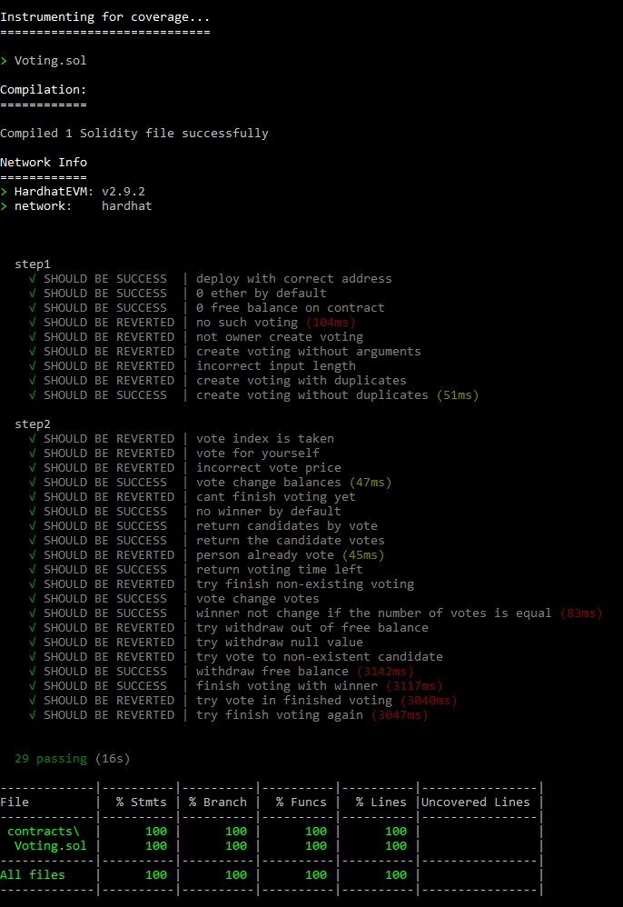
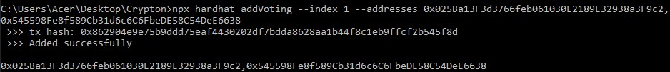
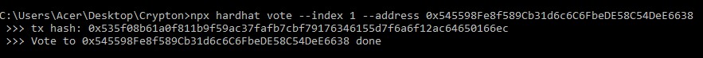
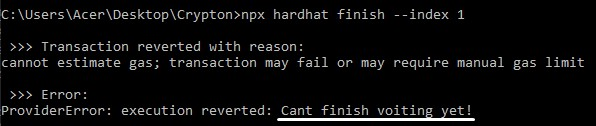
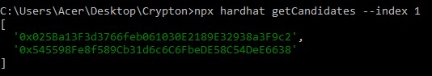
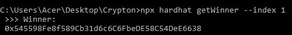
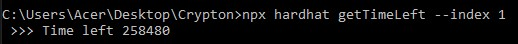

## Привет, меня зовут Илья и это доработка моего решения для Crypton!

##### В данном задании я реализовал простой контракт с динамическим добавлением одновременно выполняющихся голосований.

##### Немного пройдемся по заданию подробнее.

---

>___В папке contracts создан .sol файл, который содержит код контракта___

\> [Voting.sol]()

>___В контракте имеется функция создания голосования___

\> [function addVoting]()

>___В контракте имеется функция голосования___

\> [function vote]()

>___В контракте имеется функция завершения голосования___

\> [function finishVoting]()

>___В контракте имеется функция вывода комиссии___

\> [function withdraw]()

>___В контракте имеются дополнительные view функции для вывода информации о голосовании и участниках___

\> [function getCandidates]() возвращает адреса всех участников голосования;
\> [function getVotes]() возвращает количество голосов за конкретного кандидата;
\> [function getWinner]() возвращает адрес лидирующего кандидата;
\> [function getBalance]() возвращает баланс контракта;
\> [function getTimeLeft]() возвращает оставшееся время указанного голосования в Unix формате.

> ___В проекте утсановлен solidity-coverage и имеются тесты, обеспечивающие полное покрытие по всем показателям___

\> Все тесты располагаются в папке [test]();
\> Для удобства тесты запускаются в сети hardhat с помощью [скрипта]();
\> Реализовано полное покрытие;
\* Некоторые тесты показывают большое время выполнения (около трех секунд) из-за функции засыпания, реализованной для возможности завершения голосования по истечению его времени.

> ___В папке scripts имеется скрипт для публикации контракта в одну из тестовых сетей___

\> [Скрипт]() публикует контракт в сеть Rinkeby, которая [установлена по умолчанию]().

> ___В папке tasks имеются hardhat task`и, позволяющие взаимодействовать с опубликованным контрактом___

\> Для примера [все task'и]() выполняются от лица владельца контракта.
\> Рассмотрим несколько примеров
* [Добавление голосования]()

* [Участие в голосовании]():

* [Завершение голосования]():
Пример откаченной транзакции (голосование еще идет)

* [Получение списка участников]():

* [Получение голосов участника]():

* [Получение текущего лидера]():

* [Получение оставшегося времени]():

Время возвращается в Unix формате

* [И некоторые другие функции]()

---
### Немного подробнее

Контракт служит для проведения голосований, для участия в которых необходимо внести 0.01 ETH и указать адрес кандидата. По истечению времени, отведенного на голосование, завершить его сможет любой пользователь, а все вырученные средства, за исключением комиссии в 10%, отправятся победителю. Комиссия же останется на котнракте и вывести ее сможет в любой моммент владелец контракта.

Победитель может быть только один, а занимает лидерство кандидат, первым набравший максимальное количество голосов. Определение текущего победителя происходит при каждом отданном голосе.

Голосования могут быть добавлены динамически владельцем контракта, а обращаться к существующим голосованиям можно по индексу.

_Помимо этого, важно отметить, что далеко не всю информацию можно получить путем view функций, поскольку обратиться к большинству значений можно напрямую, а большая часть существующих view функций созданы исключительно по заданию._

---

Текущий адрес развернутого контракта [0x0Fb063EfA85288732dc4a5606a4c44c083eEEcdc](https://rinkeby.etherscan.io/address/0x0Fb063EfA85288732dc4a5606a4c44c083eEEcdc)
Автор ilkatel